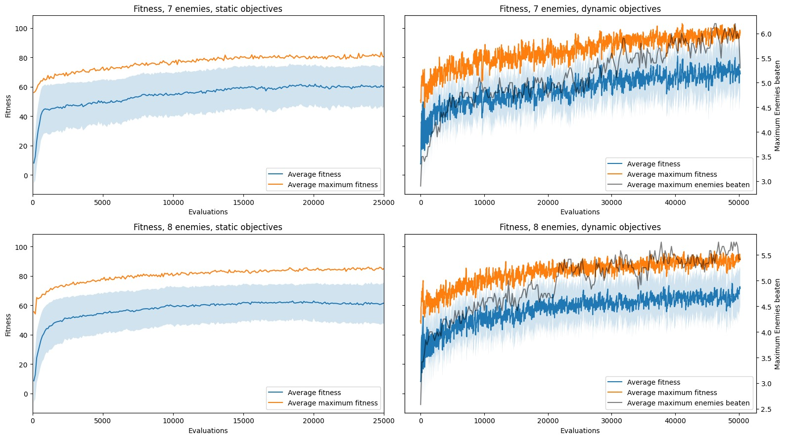
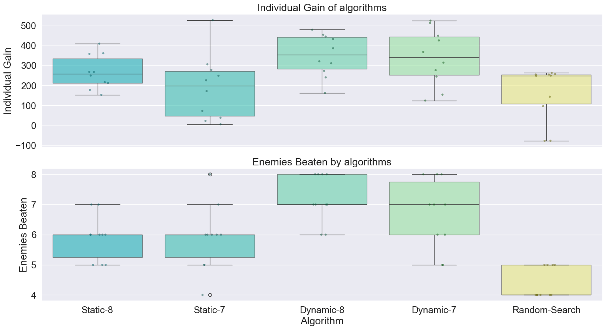

# Constraints-Led Approach to Evolving an Agent for the EvoMan Game

The Constraints-Led Approach in motor learning emphasizes adaptability and exploration by manipulation of the
environment and task objectives. The current research applied the approach to optimize an agent's performance in the
EvoMan Game. Two variants of the S-Metric Selection Evolutionary Multi-objective Optimization Algorithm (SMS-EMOA) were
employed, comparing static and dynamic many-objective selection. The dynamic objectives approach significantly
outperformed the static objectives approach for a number of enemies beaten when the algorithm was trained on eight
enemies.

## Evolutionary Multi-objective Optimization Algorithms

The S-Metric Selection Evolutionary Multi-objective Optimization Algorithm (SMS-EMOA) stands out for its ability to
handle multi-objective problems effectively [1]. Using evolutionary principles, it progressively improves solutions
towards the approximated Pareto front, a set where no single solution outperforms another across all objectives [1]. To
assess the quality of Pareto fronts, the *hypervolume measure* or *S-metric* is often used. This metric, originally
proposed by Zitzler and Thiele [2], rewards the convergence towards the Pareto front as well as the representative
distribution of points along the front. SMS-EMOA's goal is the maximization of the hypervolume measure, which is
equivalent to finding the Pareto set [3].

In the EvoMan context, considering each enemy as a separate objective yields eight distinct optimization tasks. However,
as multi-objective algorithms typically handle only two to three objectives [4] and given the computational expense of
the hypervolume metric for more than three objectives [5], objectives are strategically divided into subsets.

**Algorithm 1: SMS-EMOA with Static objectives**

The first EMOA grouped enemies based on random search performance shown in Table 1. The objectives were manually grouped
into 3 classes: *easy* containing enemies 2, 5, and 8; *medium* containing enemy 3, 4, and 7, and *hard* containing 1
and 6. These classes then were supplied to the algorithm as three objectives to optimize.

| Enemy | 1    | 2    | 3    | 4    | 5     | 6    | 7    | 8    |
|-------|------|------|------|------|-------|------|------|------|
| Win % | 0.00 | 8.54 | 0.14 | 0.02 | 11.86 | 0.00 | 0.92 | 6.72 |

**Algorithm 2: SMS-EMOA with Dynamic objectives**

The second EMOA starts with a random main population of 100 individuals. Thereafter, the following while loop is
started.

1. A random subset of 20 individuals is selected from the main population. The motivation for learning in such batches
   is to maintain population diversity regarding the objectives on which the whole population is trained.
2. Three objectives are selected based on adaptive probabilities which are initialized as 1/8.
3. A SMS-EMOA run for 10 generations is performed, and the improved subpopulation is returned. Further, the by the
   algorithm approximated Pareto optimal set is evaluated for the number of enemies its solutions can beat. The mean
   value for each enemy is added to a historical archive. The inverse of the historical archive is used to calculate the
   new selection probabilities of the enemies.
4. The improved population substitutes the initial subpopulation.
5. The Pareto Front is stored for reuse in case the next objectives coincide with the current objectives.

By applying the method in step (3), enemies that are harder to generalize receive a higher selection probability.
Thereby, the task is shaped towards the direction where the population requires improvement as prescribed by the
Constraints Led Approach. As the chance of selection remains non-zero for the remaining enemies, variation in task
composition remains present throughout the run. Thereby, potentially securing the population's ability to perform well
on currently 'easier' enemies.

## Implementation of the Algorithms

* **Pymoo Library:** Selection, Mutation, etc.

SMS-EMOA is incorporated within the Pymoo framework [6]. Being an EA, SMS-EMOA employs a set of evolutionary operators
to execute its optimization procedure. The majority of these operators adhere to Pymoo's default configurations, except
for crossover and mutation. Table 2 contains an overview of the algorithms of which a brief description will follow.

* **Representation:** The problem domain is expressed through a simple mapping from the genotype, real-valued vectors
  holding the NN weights, to the phenotype, the NN which dictates the player's movements and actions.

* **Population Initialization:** The algorithm starts with a population size of 100 random initialized individuals. In
  the dynamic objectives approach, this population is split into batches containing 20 individuals. Running these
  batches with different reassessed objectives helps maintain diversity, resulting in a rich set of potential solutions
  across iterations.

* **Parent Selection:** Individuals are randomly chosen to participate in tournaments. The winner, and hence the parent,
  is chosen based on the fewest constraint violations and multi-objective dominance criteria.

* **Crossover:** A challenge in evolving weights of NNs using genetic algorithms is finding a sensible crossover
  operation between parent networks [7]. In this study, a parent's NN is represented by a list of 256 weights. Randomly
  crossing these lists could risk losing valuable traits in the offspring, as they might inherit incomplete network
  features [7]. To address this, an NN-crossover strategy was adopted where weights were jointly crossed over. Binary
  crossover was performed for groups of weights including all incoming inputs to both hidden and output layers, along
  with their respective biases.

* **Mutation:** Gaussian Mutation is utilized to modify real-valued vectors by introducing a controlled degree of
  randomness, aiding the algorithm in exploring a wider spectrum of potential solutions [8].

* **Survival Strategy:** Least Hypervolume Contribution Survival [9] is used to evaluate solutions based on their
  contribution to the hypervolume. The algorithm maintains a balance of both dominated and non-dominated individuals in
  the population. This approach preserves valuable solutions that provide optimal trade-offs among objectives but also
  maintain diversity within the population [1].

* **Eliminating Duplicates:** The algorithm removes duplicate solutions after merging parent and offspring populations.
  If duplicates are found, the mating process is repeated to maintain unique offspring. The offspring count defaults to
  the population size.

Table 3:

| Parameter        | EA1                                     | EA2                                     |
|------------------|-----------------------------------------|-----------------------------------------|
| Representation   | Real-valued vector                      | Real-valued vector                      |
| Initialization   | Random                                  | Random                                  |
| Parent Selection | Tournament                              | Tournament                              |
| Crossover        | NN Crossover                            | NN Crossover                            |
| Mutation         | Gaussian Mutation                       | Gaussian Mutation                       |
| Selection        | Least Hypervolume Contribution Survival | Least Hypervolume Contribution Survival |
| Objectives       | Static                                  | Dynamic                                 |
| # Evaluations    | 50,000                                  | 50,000                                  |
| # Generations    | 500                                     | 10                                      |
| Population       | 100                                     | 100                                     |
| Subpopulation    | -                                       | 20                                      |
| Offspring        | 100                                     | 20                                      |

## Results

### EAs Performance Analysis

In Figure 1, the performances of the algorithms are showcased. The algorithm with static objectives reaches a fitness
plateau after about 20,000 evaluations. No clear distinction is visible between training on a set of seven or eight
enemies. The algorithm with dynamic objectives does not reach a fitness plateau within the budget of 50,000 iterations.
Again, no clear distinction between training on a set of seven or eight enemies is visible. In terms of fitness, the
algorithm with dynamic objectives seems to outperform the algorithm with static objectives.

In Figure 2, box plots show the individual gain of the best solutions and the maximal number of enemies defeated by each
of the EMOAs and random search. Since the data are not normally distributed, a Friedman test, which is a non-parametric
test alternative to the one way ANOVA with repeated measures, was used to check for differences between the algorithms.
The Friedman tests revealed a significant difference in performance across the algorithms, with χ² = 21.36 for
individual gain and χ² = 24.11 for enemies beaten, both with p < 0.001.

For post-hoc pairwise comparisons, Mann-Whitney U tests with Bonferroni correction were conducted. The post-hoc tests
indicated significant differences between Random Search and respectively Static-7 (U = 90.0, p = 0.028), Static-8 (U =
100.0, p < 0.002), Dynamic-7 (U = 100.0, p < 0.002), and Dynamic-8 (U = 100.0, p < 0.002) for individual gain. For
enemies beaten, significant differences were, again, found for all EMOAs with random search (p < 0.001), and for
Static-8-Dynamic-8 (U = 13.0, p = 0.04).

### Results of the Competition

The best 8-enemies solution was found using EMOA with dynamic objectives trained on eight enemies. The detailed results
of this solution are displayed in Table 4. It should be noted that the derived agent is far from perfect and has some
flaws in its behavior. For example, the agent is not facing the enemy when the enemy gets behind its back and performs
poorly on enemy #6.

| Enemy  | 1   | 2    | 3    | 4    | 5    | 6    | 7    | 8    |
|--------|-----|------|------|------|------|------|------|------|
| Player | 100 | 78.0 | 60.0 | 68.2 | 79.0 | 15.4 | 80.8 | 83.2 |
| Enemy  | 0   | 0    | 0    | 0    | 0    | 0    | 0    | 0    |

## Discussion

The current study examined the performance difference between EMOAs trained with static and dynamic objectives. Based on
the Constraints-Led Approach. It was hypothesized that training with dynamic objectives would outperform training with
static objectives. The results indicated that there was only a significant difference between the number of enemies
beaten between static-8 and dynamic-8.

The conservative nature of the Bonferroni correction and the limited number of runs might explain the in general
non-significant differences between the static and dynamic approaches. After all, the fitness- and box plots seem to
indicate a difference between static and dynamic approaches. Further, the fitness plots indicate that the dynamic EMOAs
continue to improve over time as opposed to the static EMOAs. The visually observed superior performance of the dynamic
objectives might be explained by its ability to escape local minima and the ability to evaluate all enemies in a
non-aggregated manner. The former might result from the changes of fitness landscape coinciding with changes of
objectives and the diversity maintaining mixing pool. The non-aggregated nature of objectives might limit the
performance of the static EMOA, as subsets should be made to simultaneously evaluate more than three enemies. Thereby,
limiting the degrees of freedom of the problem as a decrease of fitness for one enemy might coincide with an increase of
fitness for another enemy. Thereby, leading to no change in fitness and consequently no selection pressure for the
accompanying change in genome.
